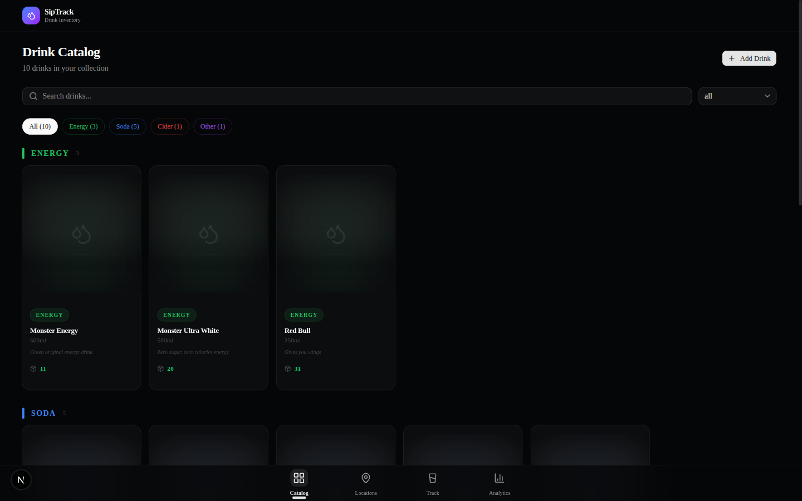
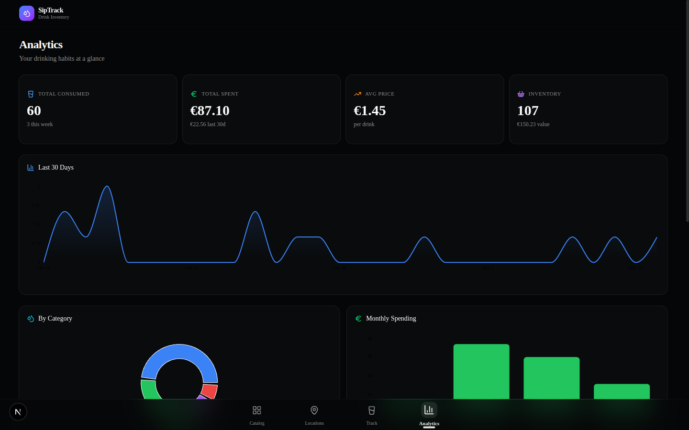
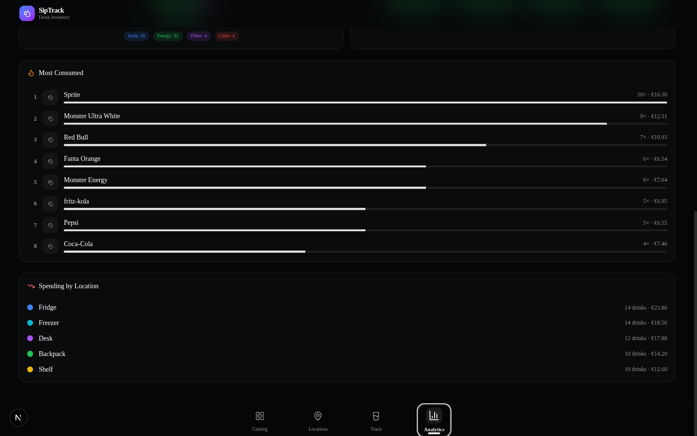
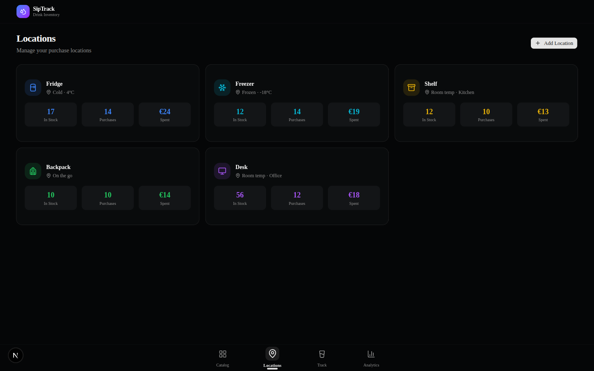
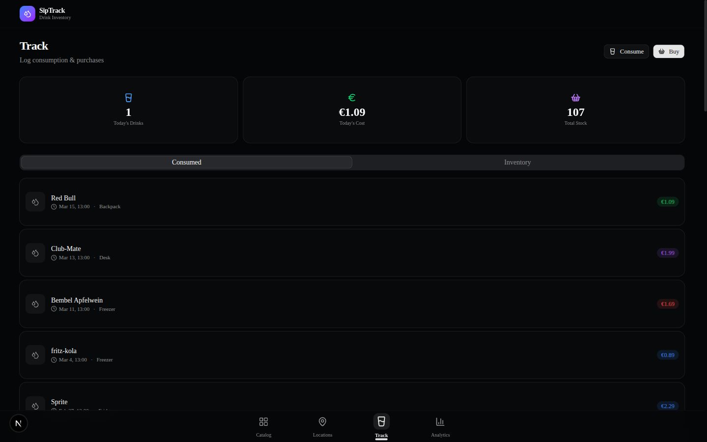

<div align="center">

# 🥤 SipTrack

**A dark, minimalistic drink inventory & analytics app for tracking your cans, bottles, and beverages at home.**

Built with Next.js 16, shadcn/ui, Tailwind CSS v4, Zustand, and Recharts.


</div>

---

## Screenshots

### Catalog — Browse & manage your drink collection
Products are grouped by category with premium showcase cards featuring ambient glow effects and radial spotlight.



### Analytics — Your drinking habits at a glance
Track consumption trends, spending by category and location, monthly costs, and most consumed drinks.




### Locations — Home storage management
Manage storage spots like Fridge, Freezer, Shelf, Backpack, and Desk with per-location stats.



### Track — Log consumption & purchases
Quick-log drinks consumed or bought, view activity history with prices and locations.



---

## Features

- **Drink Catalog** — Add, edit, and delete drinks with category, brand, volume, description, and custom images
- **Category Grouping** — Products sorted by category (Energy, Soda, Cider, etc.) with color-coded section headers
- **Premium Card Design** — Radial spotlight, category-colored ambient glow, floor reflection, and vignette effects
- **Home Locations** — Track inventory across Fridge, Freezer, Shelf, Backpack, Desk (or create your own)
- **Consumption Logging** — One-tap drink logging with location and price tracking
- **Purchase Tracking** — Log bulk purchases with per-unit pricing
- **Analytics Dashboard** — Area charts (30-day trend), pie charts (by category), bar charts (monthly spending), leaderboards (most consumed), spending by location
- **Dark Minimalistic UI** — oklch color system, JetBrains Mono font, hover/active animations on all interactive elements
- **Responsive Layout** — Scales from mobile to 4K (up to 7 columns)
- **Persistent State** — All data saved to localStorage via Zustand persist middleware
- **Deterministic Demo Data** — Seeded PRNG generates consistent sample data without hydration errors

---

## Tech Stack

| Layer | Technology |
|-------|-----------|
| Framework | [Next.js 16](https://nextjs.org) (App Router, Turbopack) |
| Language | [TypeScript 5](https://www.typescriptlang.org) |
| Styling | [Tailwind CSS v4](https://tailwindcss.com) |
| Components | [shadcn/ui v4](https://ui.shadcn.com) (base-ui) |
| State | [Zustand](https://zustand.docs.pmnd.rs) + persist middleware |
| Charts | [Recharts](https://recharts.org) |
| Icons | [Lucide React](https://lucide.dev) |
| Dates | [date-fns](https://date-fns.org) |
| Font | [JetBrains Mono](https://www.jetbrains.com/lp/mono/) |

---

## Getting Started

```bash
# Clone the repo
git clone https://github.com/c4g7-dev/siptrack.git
cd siptrack

# Install dependencies
npm install

# Run the dev server
npm run dev
```

Open [http://localhost:3000](http://localhost:3000) in your browser.

### Build for Production

```bash
npm run build
npm start
```

---

## Project Structure

```
src/
├── app/
│   ├── layout.tsx          # Root layout (JetBrains Mono, dark mode)
│   ├── globals.css         # oklch dark theme, custom scrollbar
│   └── page.tsx            # Entry point
├── components/
│   ├── app-shell.tsx       # Main layout with header & bottom nav
│   ├── pages/
│   │   ├── catalog-page.tsx    # Grouped product catalog
│   │   ├── locations-page.tsx  # Home storage manager
│   │   ├── track-page.tsx      # Consumption & purchase logger
│   │   └── analytics-page.tsx  # Charts & stats dashboard
│   └── ui/                 # shadcn/ui components
└── lib/
    ├── types.ts            # TypeScript interfaces
    ├── data.ts             # Default products, locations, colors
    └── store.ts            # Zustand store with persist
```

---

## License

MIT
